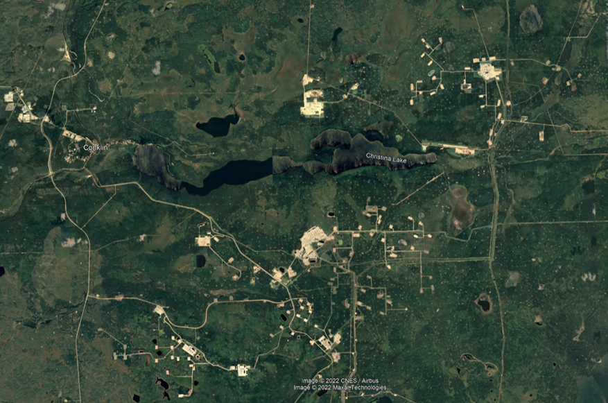
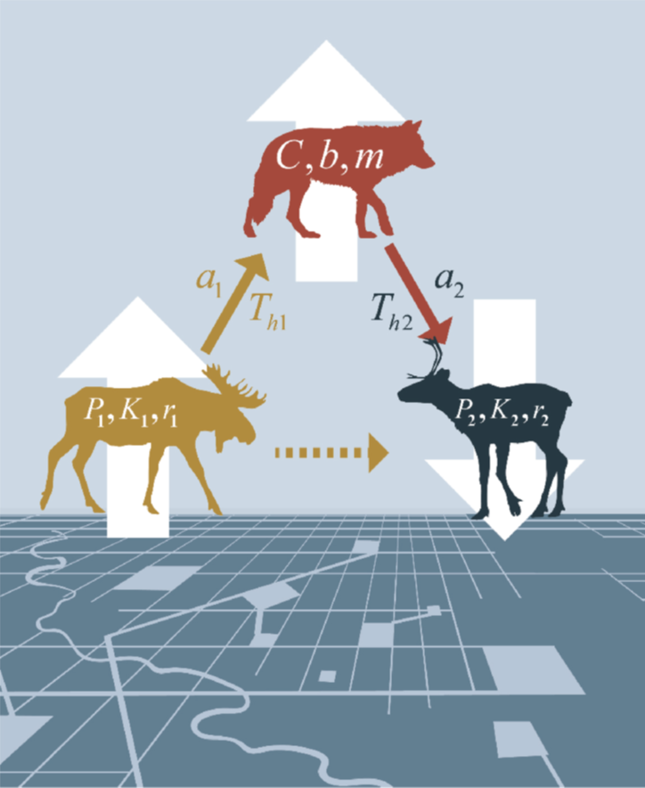
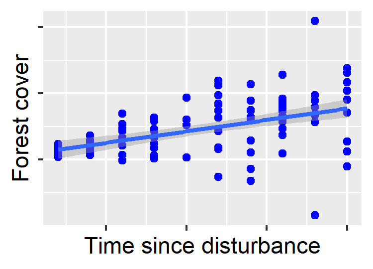
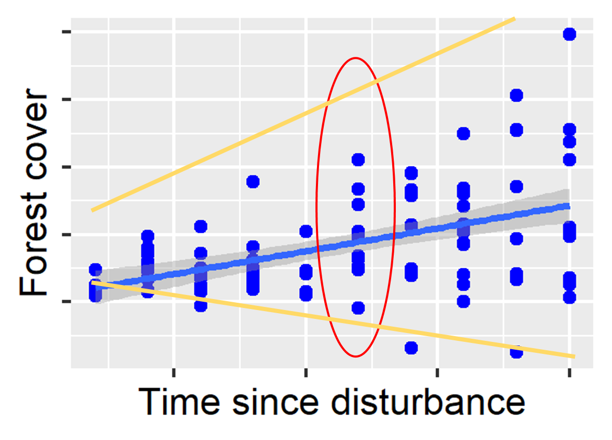
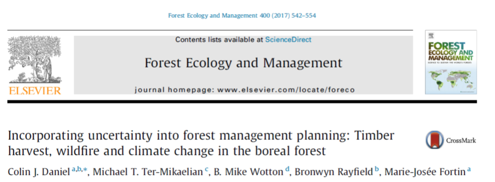

layout: true

background-image: url('background.png')
background-size: cover

---

# Biodiversity Risk Asessment in the Oil Sands Region 

### *Actionable science for making decisions* 


## Andy Crosby | Scott Nielsen | Erin Bayne 
### December 15, 2022  
<br />
<br />
<br />
<br />
<br />
<br />

##### Background image credit: Michael Benz
---

# **The Roadmap:** 

--

## Describing our overall approach 

--

## Risk Assessment vs. 'Prediction' 

--

## From science to decisions

---

# **Climate Vulnerability and Adaptation** 

## The  world has moved on...  

# .center[Species are **Vulnerable** to change]  

## What can we do? 

# .center[We can **Adapt** to this change]  


---
# **Some terms:** 

## **Vulnerability:** *Exposure*, *Sensitivity*, and *Adaptive Capacity* of species or systems to environmental change
<br />
## **Adaptation:** intentional adjustments to natural systems to address bioidiversity risks posed by vulnerability 
<br />

---
layout: false 

# **Ecosystem Transformation** 
(Thompson et al. 2022; Fisheries)


---
# **Changing Response Pathways in the Boreal ** 

.pull-left[
### 1. **Resilience:** historic  successional pathway
### 2. **Restructuring:** same composition, new structure 
### 3. **Reassembly:** same structure, new composition
### 4. **Replacement:** new composition and structure
### 5. **Regime shift:** no longer a forest
]

.pull-right[

#### (Seidle and Turner 2022; PNAS)
]

---
# Effects of Forest Fragmentation 
.pull-left[

]

.pull-right[

#### (Serrouya et a,. 2020; Ecological Modeling)
]
---
layout: true 
background-image: url('background.png')
background-size: cover

---
# The overall goals of the Risk Assessment framework 

## 1. Assess boidiversity risks in terms of vulnerability to landscape and climate change 

## 2. Inform the development of adaptation strategies 
<br >
# .center[The key challenge is uncertainty ]

---
# **The Problem of Predicting the Future** 
<br >
##.center[We know that the future is uncertain.]
<br >

##.center[Future ecosystem states are difficult (i.e. *Impossible*) to predict]


---
layout: false 

# **The limits of deterministic modelling** 

```{r reg-plot, echo = FALSE, fig.show = "hide", include = FALSE}
library(ggplot2)
n <- 100; a = 1; b = 0.15; sigma2 = 5; x = sample(seq(10, 100, 10), 100, replace = TRUE)
set.seed(111)
eps = rnorm(n, mean = 0, sd = sqrt(sigma2)) 
y <- a + b*x + eps*(0.05*x)

ggplot() + aes(x, y) + geom_point(colour = "blue") + stat_smooth(method = lm, formula = y ~ x, geom = "smooth") + xlab("Time since disturbance") + ylab("Forest cover") + theme(axis.text = element_blank())

ggsave(filename = "reg-plot.png", width = 2.5, height = 1.8) 

```


---
# **The limits of deterministic modelling** 



---
# **Forecasting and the Risk Assessment Framework**  

## What do these things mean?

## .center[Forecasting estimates future conditions based on knowledge of ecological processes]
<br >

##.center[Risk assessment calculates the probabilities of various outcomes based on the forecasting model]

---
# Implementing Risk Assessment 




---
# Failure to consider uncertainty in wildfire and harvest 


---
# Probabilities of harvest shortfall


---
# From Forestry to Oil Sands 


---
# **Responding to RADical Change:** **R**esist-**A**ccept-**D**irect 
### (Lynch et al. 2022; Frontiers in Ecology and the Environment) 

## Identify adaptation pathways based on Ecological, Economic, and Societal feasibility to: 
## - **Resist** ecological transformations (i.e. maintain or restore past conditions)
## - **Accept** coming changes without intervention 
## - **Direct** change to achieve a desired future state 


---

# Assessing and enhancing adaptive capacity for at-risk species 


---
layout: false 

# **The Critical Importance of Scale** 

##**1.  Defining population of concern** 


---
# **The Critical Importance of Scale** 

##**2.  Conditional vs. marginal effects of Development** 
###- **Conditional:** the independent effect of a single development 
###- **Marginal:** The combined (cumulative*****) effects of multiple developments 
<br />
## .center[***Cumulative effects can be greater than the sum of their parts**]

---
# **The Critical Importance of Scale** 

##**2.  Conditional vs. marginal effects of Development** 


---
layout: true 
background-image: url('background.png')
background-size: cover

---


---


