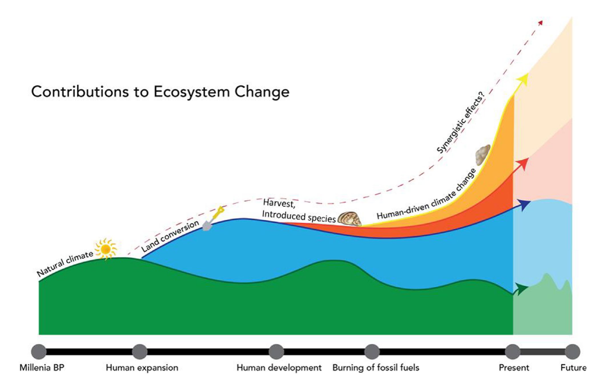
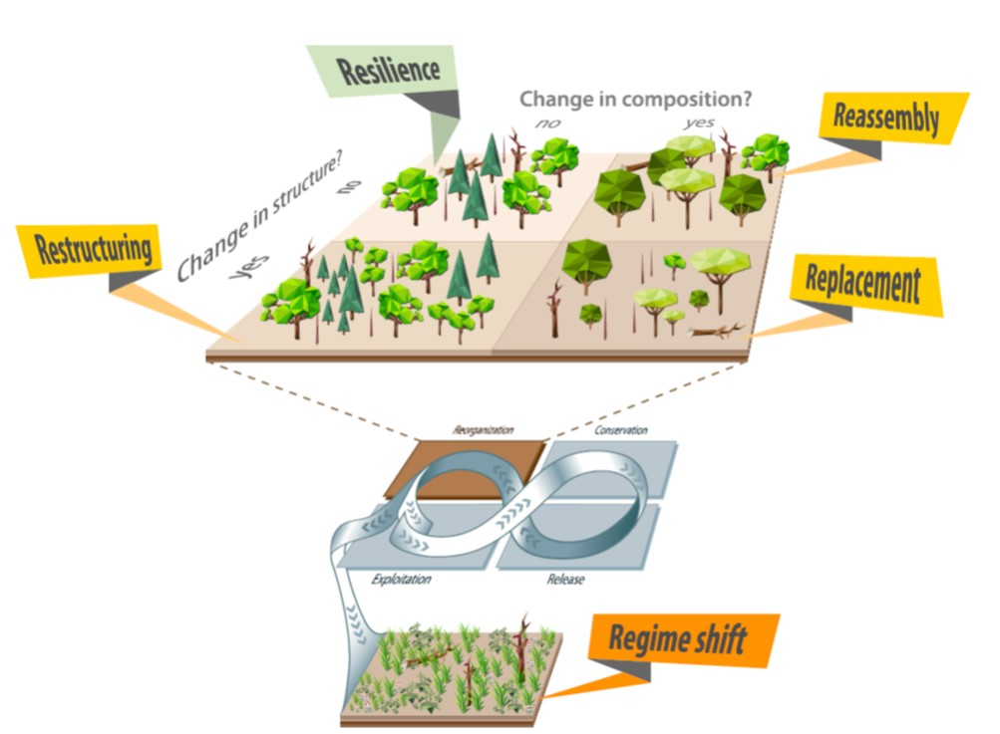
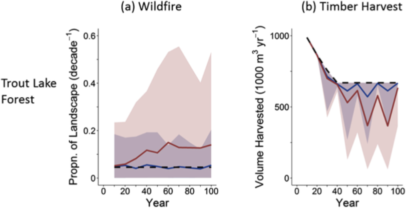
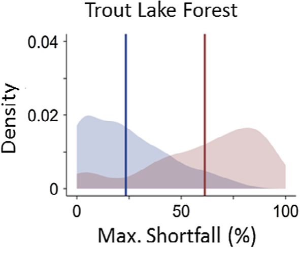
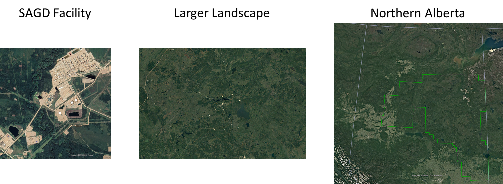
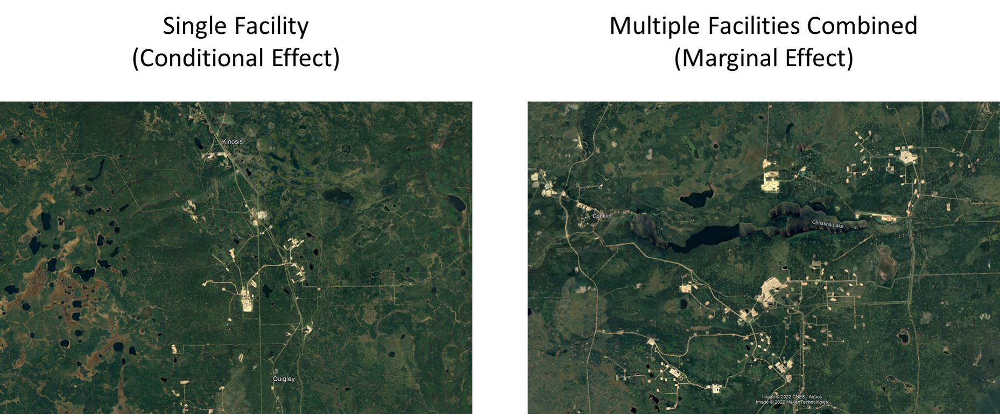

layout: true

background-image: url('background.png')
background-size: cover

---

# Biodiversity Risk Asessment in the Oil Sands Region 

### *Actionable science for making decisions* 

## Andy Crosby | Scott Nielsen | Erin Bayne 
### December 15, 2022  
 
 
 
 
 
 

##### Background image credit: Michael Benz
---

# **The Roadmap:** 

--

## Describing our overall approach 

--

## Risk Assessment vs. 'Prediction' 

--

## From science to decisions

---

# **Climate Adaptation and the R.A.D. framework** 

## The  world has moved on...  

# .center[ **Adaptation**]  

## So what should we do? 

# .center[**R**esist | **A**ccept | **D**irect]

---
# **Some terms:** 

## **Adaptation:** intentional adjustments to natural systems to reduce risks from climate change
 
## **Vulnerability:** *Exposure*, *Sensitivity*, and *Adaptive Capacity* of species or systems 
 

---

# **Ecosystem Transformation** 
## The emergence of new ecological states
 
## Caused by disturbance-climate Interactions
 
## Occurring at unprecedented rates

---
layout: false 

# **Ecosystem Transformation** 
(Thompson et al. 2022; Fisheries)

---
# **Changing Response Pathways in the Boreal ** 

.pull-left[
### 1. **Resilliance:** historic  successional pathway
### 2. **Restructuring:** same composition, new structure 
### 3. **Reassembly:** same structure, new composition
### 4. **Replacement:** new composition and structure
### 5. **Regime shift:** no longer a forest
]

.pull-right[

#### (Seidle and Turner 2022; PNAS)
]

---
layout: true 
background-image: url('background.png')
background-size: cover
---
# **Responding to RADical Change:** **R**esist-**A**ccept-**D**irect 
### (Lynch et al. 2022; Frontiers in Ecology and the Environment) 

## Identify adaptation pathways based on Ecological, Economic, and Societal feasibility to: 
## - **Resist** ecological transformations (i.e. maintain or restore past conditions)
## - **Accept** coming changes without intervention 
## - **Direct** change to achieve a desired future state 

---
# The overall goals of the Risk Assessment framework 
## 1. Assess boidiversity risks in terms of climate vulnerability 
## 2. Inform adaptation strategies according to the RAD framework 

---
# **The Risk Assessment Approach** 

## Why? 

##.center[We know that the future is uncertain.]

##.center[The key objective of the risk assessment approach is to develop the necessary tools to deal with that uncertainty. ]

---
# **Prediction vs. Forecasting** 

## Talk about the coin flip and the weigheted coin 

---
# **Prediction vs. Forecasting** 

## Talk about rolling a die and the die being weighted 

---
# **Prediction vs. Forecasting** 

## Talk about rolling multiple dice and different die being weighted in different ways 

## Make a point of the difficulty of predicting what the outcome will be with so many possibilities 

## Talk about how it makes more sense to ask different quesitions, e.g.: 

- What is the probability of at least 3 of the dice being > 4? 

- What is the risk that at least 2 of the dice will be < 3?  

---
# Failure to consider uncertainty in wildfire and harvest 

---
# Probabilities of harvest shortfall

---
layout: false 

# **The Critical Importance of Scale** 

##**1.  Defining population of concern** 

---
# **The Critical Importance of Scale** 

##**2.  Conditional vs. marginal effects of Development** 
###- **Conditional:** the independent effect of a single development 
###- **Marginal:** The combined (cumulative*****) effects of multiple developments 
 
## .center[***Cumulative effects can be greater than the sum of their parts**]

---
# **The Critical Importance of Scale** 

##**2.  Conditional vs. marginal effects of Development** 

---
layout: true 
background-image: url('background.png')
background-size: cover

---

---

